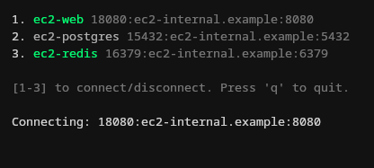

# SshTunnels

Interactive _SSH_ tunnel management. Console UI powered by [ncurses](https://invisible-island.net/ncurses/).



## Installation

```bash
gem install ssh_tunnels
```

## Usage

```bash
ssh_tunnels -c config.yml
```

Alternatively, default to using `~/.ssh_tunnels.yml` for configuration:

```bash
ssh_tunnels
```

## Configuration

### Gateways

There are two ways to configure an SSH gateway. Both can be used together, but at least one must be defined:

1. Define a `default_gateway` section in your configuration file.
1. Define a `gateways` section in your conifguration file.

The `default_gateway` is a map containing these keys:

* `host`: hostname or IP address of gateway (required).
* `port`: SSH port on gateway (default: `22`).
* `user`: Username on gateway to connect with (default: `$USER`).

The `gateways` section is also a map, but each key represents a named gateway, and each gateway is configured using the same parameters as `default_gateway`.

Each named gateway can be referred to in the `gateway` field for each tunnel.

```yaml
# config.yml

default_gateway:
  host: gateway.example.com

gateways:
  aws:
    host: 111.111.111.111
    user: ubuntu
  azure:
    host: 222.222.222.222
    user: william
```

### Tunnels

The `tunnels` section is a map where each key represents a named tunnel. Each tunnel can be configured using the following parameters:

* `host`: The remote host to connect to from the gateway.
* `remote`: The remote port to use for forwarding.
* `local`: The local port to bind to (defaults to the `remote` port).

```yaml
# config.yml

default_gateway:
  host: gateway.example.com

gateways:
  aws:
    host: 111.111.111.111
    user: ubuntu

tunnels:
  my_host:
    local: 1234
    host: my.host.example.com
    remote: 4567
  other_host:
    gateway: aws
    local: 1111
    host: other.host.example.com
    remote: 5555
```

## Contributing

Pull requests are welcome.

## License

The gem is available as open source under the terms of the [MIT License](https://opensource.org/licenses/MIT).
